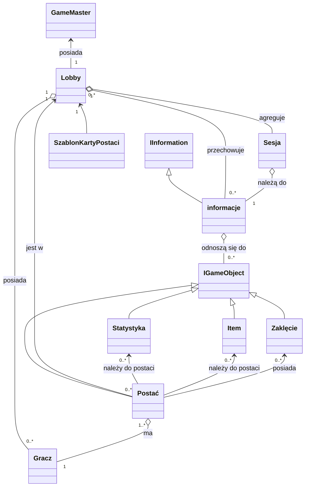

# Model domeny

```mermaid
classDiagram
    class GameMaster["GameMaster"]
    class Zaklecie["Zaklęcie"]
    class Postac["Postać"]


    %% Dziedziczenie (strzałka z grotem)
    IInformation <|-- informacje
    IGameObject <|-- Statystyka
    IGameObject <|-- Item
    IGameObject <|-- Zaklecie
    IGameObject <|-- Postac


    %% Agregacja (romb / kwadrat na połączeniu)
    Lobby "1" o-- "0..*" Gracz : posiada
    informacje o-- "0..*" IGameObject : odnoszą się do
    Postac "1..*" o-- "1" Gracz : ma
    Lobby "0..*" o-- Sesja: agreguje
    Lobby "1" o-- "0..*" informacje : przechowuje
    Sesja o-- "1" informacje : należą do


    %% Referencja (zwykła linia)
    GameMaster <-- "1" Lobby : posiada
    Lobby "1" <--  SzablonKartyPostaci
    Lobby "1" <-- "0..*" Postac : jest w
    Statystyka "0..*" <-- Postac : należy do postaci
    Item "0..*" <-- Postac : należy do postaci
    Zaklecie "0..*" <-- Postac : posiada
```
